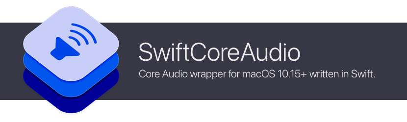

# SwiftCoreAudio

[](https://swiftpackageindex.com/orchetect/swift-core-audio) [](https://swiftpackageindex.com/orchetect/swift-core-audio) [](https://github.com/orchetect/swift-core-audio/blob/main/LICENSE)

[Core Audio](https://developer.apple.com/documentation/CoreAudio) wrapper for macOS 10.15+ written in Swift with the goal of having:

- User-friendly, approachable API for both beginners and power-users
- All objects and types are value types, allowing implicit thread-safety and makes retain cycles virtually impossible
- Clean, lightweight Swift-native value types
- Data models to allow capturing Core Audio state for debugging or bug reporting
- Verbose documentation for objects, methods, types and errors

## Development Roadmap

> [!IMPORTANT]
>
> This library is under active iterative development and as such, some features may be missing or incomplete. The API is subject to code-breaking changes prior to major version 1.0.0.
>

## Getting Started

This library is available as a Swift Package Manager (SPM) package.

1. Add the **swift-core-audio** repo as a dependency.

   ```swift
   .package(url: "https://github.com/orchetect/swift-core-audio", from: "0.1.0")
   ```

2. Add **SwiftCoreAudio** to your target.

   ```swift
   .product(name: "SwiftCoreAudio", package: "swift-core-audio")
   ```

3. Import **SwiftCoreAudio** to use it.

   ```swift
   import SwiftCoreAudio
   ```

## Documentation

See the [online documentation](https://swiftpackageindex.com/orchetect/swift-core-audio/documentation) for library usage and getting started info.

## Dependencies

- [SwiftProcess](https://github.com/orchetect/swift-process) for PID and bundle ID types and operations.

## Author

Coded by a bunch of 🐹 hamsters in a trenchcoat that calls itself [@orchetect](https://github.com/orchetect).

## License

Licensed under the MIT license. See [LICENSE](LICENSE) for details.

## Sponsoring

If you enjoy using this library and want to contribute to open-source financially, GitHub sponsorship is much appreciated. Feedback and code contributions are also welcome.

## Community & Support

Please do not email maintainers for technical support. Several options are available for issues and questions:

- Questions and feature ideas can be posted to [Discussions](https://github.com/orchetect/swift-core-audio/discussions).
- If an issue is a verifiable bug with reproducible steps it may be posted in [Issues](https://github.com/orchetect/swift-core-audio/issues).

## Contributions

Contributions are welcome. Posting in [Discussions](https://github.com/orchetect/swift-core-audio/discussions) first prior to new submitting PRs for features or modifications is encouraged.

## Code Quality & AI Contribution Policy

In an effort to maintain a consistent level of code quality and safety, this repository was built by hand and is maintained without the use of AI code generation.

AI-assisted contributions are welcome, but must remain modest in scope, maintain the same degree of quality and care, and be thoroughly vetted before acceptance.
